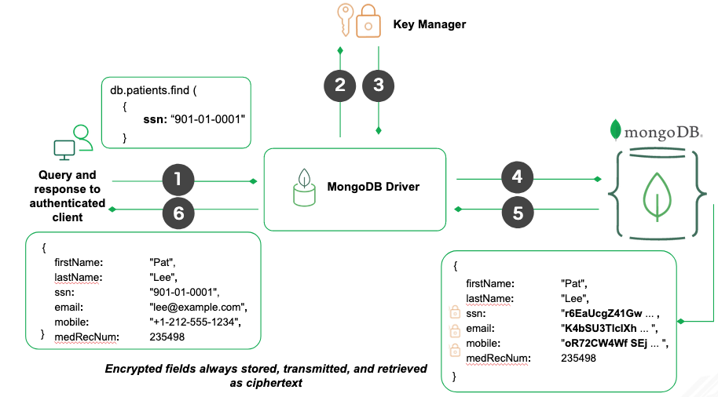
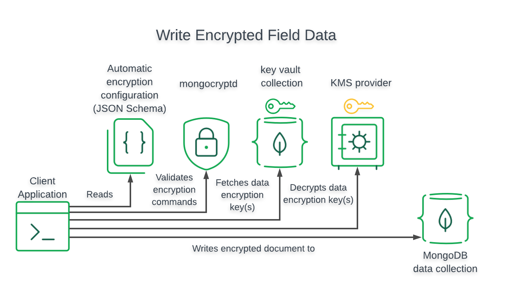

MongoDB Client-Side Field Level Encryption in Java Practice
==

 

Data is encrypt and decrypt in client side, which client owns the key can encrypt and decrypt data, otherwise data is protect.

 

1.Understand Reads and Writes in MongoDB
--

*	Prepare your MongoDB Server and Basic Program

*	Runtime Property：
> Config Properties

		Config.java (connectionString, dbName, collName)

* There are 2 ways you can interact with MongoDB

*	MongoClient :

> Using MongoDB Java Driver

		BasicConnectAndQuery.java
		BasicConnectAndWrite.java
		BasicConnectAndDelete.java
	
*	MongoTemplate :
> Using Springboot MongoDB

		BasicConnectAndQuery.java
		BasicConnectAndWrite.java

2.Prepare Encrypt Key and Key Space
--

*	Prepare Key, will using local key feature

*	Runtime Property：
> Config Properties

		Config.java (masterKeyFile, keyVaultNamespace, keyVaultDb, keyVaultCollection)
		
*	CreateMasterKey :
	
		CreateMasterKey.java to create key file master-key.txt
		only need to run in one time
  
*	CreateDataKey

		CreateDataKey.java to create datakey data in db namespace keyVaultNamespace, record base64KeyId
		only need to run in one time, record base64DataKeyId and insert into Config.java
  
*	CheckDataKey

		CreateDataKey.java to check base64KeyId exists

3.Reads and Writes Data in Encryption
-

*	Runtime Property：
> Config Properties

		Config.java ( check all property have been modified )

*	Sample Datamodel：

		Firstname, Lastname, Age (Encrypts)
	
*		Result in DB side
	
	
	
*		Result in AP side
	
	

*	Write and Query Encryption Automatic
> Use AutoEncryptionSettings can setting schemaMap, to make 

*	Write and Query Encryption Manually

4.Manually Setting mongocryptd
-

*	Running mongocryptd separately：
> 
